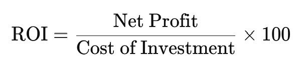
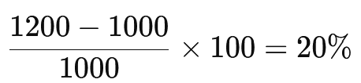

## Royalty Vs ROI (Return on Investment)
### Royalty:
**A royalty** is a **payment made to the owner of an asset (usually intellectual property)** for the right to use that asset. In finance or trading, royalties are common in industries like music, books, natural resources, and franchising — not so much in everyday stock or forex trading.

### ROI (Return on Investment):
**ROI** measures how much **profit or loss** you’ve made on an investment, **relative to the initial cost**. It’s a performance metric used in **all types of trading and investing**.

---

##  Formula
### Royalty: 
Typically calculated as a **percentage of revenue or profit** generated by using the asset.

Example: 
> A musician might earn 5% of sales as royalty on each album sold.

### ROI:

Example:
> You invest $1,000 in a stock and sell it for $1,200. Your ROI is:
> 
