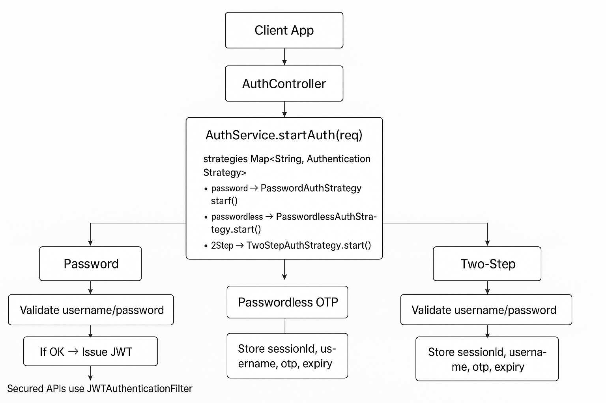

## ❓ Q1: What is the purpose of `AuthenticationEntryPoint`?
🅰️: `AuthenticationEntryPoint` is used to handle unauthorized access **when no authentication is provided**. It is triggered when a request is made to a protected resource without valid credentials (e.g., missing or expired JWT). It typically returns a `401 Unauthorized` response.

## ❓ Q2: When is `AuthenticationEntryPoint` called?
🅰️: It is called **before any authentication attempt**, when a user tries to access a secured endpoint **without being authenticated**.

## ❓ Q3: What is the purpose of `AuthenticationFailureHandler`?
🅰️: `AuthenticationFailureHandler` is triggered **when authentication fails** during a login attempt. For example, if a user provides invalid credentials (wrong username or password), this handler is called to return an error response.

## ❓ Q4: When is `AuthenticationFailureHandler` called?
🅰️: It is called `during an authentication attempt`, typically through a login form or custom login endpoint, `when the provided credentials are invalid`.

## ❓ Q5: How are they configured in Spring Security?
🅰️: `AuthenticationEntryPoint` is configured like this:
````java
http.exceptionHandling()
    .authenticationEntryPoint(unauthorizedHandler);
````

`AuthenticationFailureHandler` is set on the login filter:
````java
customLoginFilter.setAuthenticationFailureHandler(customFailureHandler);
````

##  Q6: What is a simple analogy to understand the difference?
- `AuthenticationEntryPoint`: <br/>
  You tried to enter a restricted area without showing any ID — you get stopped at the gate.
- `AuthenticationFailureHandler`: <br/>
  You showed an ID, but it was fake or invalid — you get rejected during verification.


## Summary Table?
| Feature                | `AuthenticationEntryPoint`                         | `AuthenticationFailureHandler`       |
| ---------------------- | -------------------------------------------------- |--------------------------------------|
| **When triggered**     | No authentication provided                         | Invalid authentication attempt       |
| **Typical context**    | Accessing a protected resource without login/token | Login attempt with wrong credentials |
| **Returns**            | 401 Unauthorized                                   | 401, error message, or redirect      |
| **Use case**           | Stateless APIs (e.g. JWT)                          | Login flow  (Form login / custom login filters)                       |
| **Where to configure** | `http.exceptionHandling()`                         | On login/authentication filter       |


---

# How passwordless 2-step verification works
The basic flow is:
1. User requests login (provides only username/email/phone — no password).
2. Backend generates an OTP (or magic link) and sends it (email/SMS/etc.).
3. User enters the OTP (or clicks link).
4. Backend verifies OTP.
5. Backend issues JWT token.

## 1. Why you need a new strategy
In your current code:
````java
AuthenticationStrategy s = strategies.get(flow);
````
Each strategy handles a specific `flow`. <br/>
Currently you have:
- `"password"` → username + password login.
- Maybe `"otp"` for second-factor in password flow.
For passwordless, you’d add:
- `"passwordless"` → username/email only → sends OTP.


## 2. Implementation steps
### (a) Define a `PasswordlessAuthStrategy`
````java
@Component("passwordless")
@RequiredArgsConstructor
public class PasswordlessAuthStrategy implements AuthenticationStrategy {
    private final OtpService otpService;

    @Override
    public Object start(AuthRequest req) {
        String usernameOrEmail = req.getUsername();
        // Generate OTP and sessionId
        String sessionId = otpService.createSession(usernameOrEmail);
        otpService.sendOtp(usernameOrEmail, sessionId);
        return Map.of("message", "OTP sent", "sessionId", sessionId);
    }
}
````
### (b) Add OTP verification endpoint
````java
@PostMapping("/verify-otp")
public AuthResponse verifyOtp(@RequestParam String sessionId, @RequestParam String otp) {
    return authService.verifyOtpAndIssueToken(sessionId, otp);
}
````
This will work for passwordless too — just reuse it. <br/>
The difference is: in passwordless, the session was created without a password check.

### (c) No password authentication provider needed
Since passwordless bypasses the password check, you don’t need a `DaoAuthenticationProvider` in this flow — it’s pure OTP.

---

## 3. Security considerations
- OTP lifetime should be short (e.g., 2–5 minutes).
- Session binding: OTP should only be valid for the user/session it was issued to.
- Rate limiting: prevent brute-force OTP guesses.
- Fallback: Optionally still support password login for locked-out OTP users.

## 4. Where the strategies fit
Now your flows might look like:

| Flow name        | Strategy Class             | Step 1 Action                        | Step 2 Action           |
| ---------------- | -------------------------- | ------------------------------------ | ----------------------- |
| `"password"`     | `PasswordAuthStrategy`     | Verify username + password           | Optional OTP if enabled |
| `"passwordless"` | `PasswordlessAuthStrategy` | Send OTP to email/phone              | Verify OTP → issue JWT  |
| `"otp-only"`     | `OtpAuthStrategy`          | Skip initial login (used for step 2) | Verify OTP              |


---

# Flow Diagram

## 1️⃣ Step 1 – Request Login (Start Auth)
````css
[Client] ---- username/email ----> [POST /api/auth/start]

    AuthController.startAuth(AuthRequest req)
        ↓
    AuthService.startAuth(req)
        ↓
    strategies.get("passwordless") → PasswordlessAuthStrategy.start()
            • Create sessionId in OtpService
            • Generate OTP (e.g., 6-digit)
            • Store (username, otp, expiry) in cache/DB
            • Send OTP to user via SMS/Email
        ↓
    Return JSON: { message: "OTP sent", sessionId: "abc123" }
[Client] <---- OTP sent ----
````

## 2️⃣ Step 2 – Verify OTP
````plantext
[Client] ---- sessionId + otp ----> [POST /api/auth/verify-otp]

    AuthController.verifyOtp(sessionId, otp)
        ↓
    AuthService.verifyOtpAndIssueToken(sessionId, otp)
        ↓
    otpService.verify(sessionId, otp)
            IF fail → throw OtpInvalidException
        ↓
    username = otpService.getUsernameForSession(sessionId)
    token = jwtProvider.generateToken(username)
    Return AuthResponse { token, expAt }
[Client] <---- JWT token ----
````

## 3️⃣ JWT-protected API calls
````plaintext
[Client] ---- Authorization: Bearer <token> ----> [GET /api/secure/data]

    JwtAuthenticationFilter
        • Extract token
        • Validate signature & expiry
        • Load UserDetails
        • Set SecurityContext
        ↓
    Controller executes with authenticated principal
[Client] <---- Secure data ----
````

## 📌 Exception Handling Flow
````plaintext
IF otpService.verify() fails → OtpInvalidException
    ↓
Caught by:
    - If thrown during auth filter → AuthEntryPoint (401 JSON)
    - If thrown in controller/service → GlobalExceptionHandler for security module

````

## 💡 High-Level Diagram
````pgsql
+---------+        +-------------------+        +-------------------+
|  Client | -----> | /api/auth/start    | -----> | PasswordlessAuth   |
|         |        | (flow=passwordless)|        | Strategy.start()   |
+---------+        +-------------------+        +-------------------+
                                                  |
                                                  v
                                            +-----------+
                                            | OtpService|
                                            | createOTP |
                                            +-----------+
                                                  |
                                                  v
                                             OTP sent to user
                                                  |
                                                  v
+---------+        +-------------------+        +-------------------+
|  Client | -----> | /api/auth/verify-otp| ----> | AuthService.verify|
|         |        +-------------------+        +-------------------+
                                                  |
                                                  v
                                            +-----------+
                                            | OtpService|
                                            | verifyOTP |
                                            +-----------+
                                                  |
                                                  v
                                             Generate JWT
                                                  |
                                                  v
+---------+ <--------------------------------+-----------+
|  Client |                                  | AuthResponse|
+---------+                                  +-----------+

````

## 📌 Unified High-Level Flow Diagram
````pgsql
                        +---------------------+
                        |     Client App      |
                        +----------+----------+
                                   |
                        POST /api/auth/start
                                   |
                                   v
                        +----------+----------+
                        |   AuthController    |
                        +----------+----------+
                                   |
                      AuthService.startAuth(req)
                                   |
                                   v
+-----------------------------------------------------------+
| strategies Map<String, AuthenticationStrategy>            |
|-----------------------------------------------------------|
| "password"   → PasswordAuthStrategy.start()               |
| "passwordless" → PasswordlessAuthStrategy.start()         |
| "2step"      → TwoStepAuthStrategy.start()                |
+-----------------------------------------------------------+
                                   |
                 +-----------------+-----------------+
                 |                                   |
   Password Flow (1)                      OTP Generation Flow (2 & 3)
                 |                                   |
   Validate username/password              Create OTP in OtpService
   If OK → Issue JWT (Flow 1)               Store sessionId, username, otp, expiry
                                             Send OTP via Email/SMS
                 |                                   |
                 v                                   v
           Return JWT                     Return { message, sessionId }
           (Flow 1 ends)                    (Flow 2 & 3 go to next step)
                 |
                 v
--- Secured APIs use JWTAuthenticationFilter to validate token ---


               **Step 2 for OTP-based Flows (Passwordless & 2-step)**

                        +----------------------+
                        | POST /verify-otp     |
                        +----------------------+
                                   |
                        AuthService.verifyOtpAndIssueToken
                                   |
                                   v
                        OtpService.verify(sessionId, otp)
                                   |
                        If fail → throw OtpInvalidException
                                   |
                        If pass → Get username from session
                                   |
                        Generate JWT via JwtProvider
                                   |
                        Return AuthResponse { token, expAt }
                                   |
                        Client stores token for subsequent API calls

````

## 🗂 Flow Summary Table
| Flow Name        | Step 1 Action                                      | Step 2 Action                    | Token Issued?     |
| ---------------- | -------------------------------------------------- | -------------------------------- | ----------------- |
| Password         | `/startAuth` with username/password → verify → JWT | N/A                              | Yes (immediately) |
| Passwordless OTP | `/startAuth` with username → OTP sent              | `/verify-otp` with sessionId+otp | Yes               |
| Two-Step         | `/startAuth` with username/password → OTP sent     | `/verify-otp` with sessionId+otp | Yes               |


## Architecture



---

## Points to production-hardening (next steps)
1. Record login audits, IP and device info.
2. Limit OTP attempts and rate-limit login attempts.
3. Rate limiting: prevent brute-force OTP guesses.
4. Fallback: Optionally still support password login for locked-out OTP users.
5. Add refresh-token support
6. Use TLS/HTTPS always.
7. Use secure, sufficiently random secret for JWT. Rotate keys using JWKs if needed.
8. Add multi-factor backup codes, remember-device, TOTP (Google Authenticator) support as additional strategies.


---

# 1. Record login audits, IP and device info
````java
CREATE TABLE auth_audit (
  id BIGSERIAL PRIMARY KEY,
  username VARCHAR(255),
  flow VARCHAR(50),          -- e.g. "password","passwordless","2step"
  outcome VARCHAR(20),       -- "SUCCESS" or "FAIL"
  reason VARCHAR(255),       -- optional failure reason
  ip VARCHAR(45),
  user_agent TEXT,
  device_id VARCHAR(255),    -- optional client-generated device id
  created_at timestamptz DEFAULT now()
);
````

### Spring entity + service (sketch)
````java
@Entity class AuthAudit { /* fields from schema */ }

@Service class AuthAuditService {
  private final AuthAuditRepository repo;
  public void record(String username, String flow, String outcome, String reason,
                     HttpServletRequest req) {
    String ip = extractIp(req);
    String ua = req.getHeader("User-Agent");
    String device = req.getHeader("X-Device-Id"); // optional
    repo.save(new AuthAudit(...));
  }
}
````
Where to call — call `AuthAuditService.record(...)`:
- On every AuthService.startAuth(...) (record attempt).
- On verifyOtpAndIssueToken(...) (record success/fail).
- On JWT login via refresh or form.


# 2) Limit OTP attempts and rate-limit login attempts
Two layers:
1. **Per-session OTP attempts** — track attempts for a `sessionId` (from `OtpService`).
2. **Per-user and per-IP rate limiting** — block or slow down after N attempts/period.

Store attempt counters in Redis (fast, TTL support): <br/>
Key examples:
- `otp:attempt:{sessionId}` → increment, TTL = session TTL
- `login:attempt:user:{username}` → increment, TTL e.g. 1 hour
- `login:attempt:ip:{ip}` → increment, TTL e.g. 1 hour


Pseudo-code
````java
int attempts = redis.incr("otp:attempt:" + sessionId);
if (attempts == 1) redis.expire(..., otpTtlSeconds);
if (attempts > MAX_OTP_TRIES) throw new OtpInvalidException("Too many attempts");
````
**Libraries:**
- For rate-limiting: **Bucket4j** (in-memory or distributed with Redis) or Redis token bucket using Lua scripts
- For Spring integration: `resilience4j-ratelimiter` or `spring-boot-starter-redis` + custom logic.


# 3) Rate limiting: prevent brute-force OTP guesses
Same technique as (2), but hardened:
- **Block windows**: after N failures within window T, temporarily block (e.g., 5 attempts → block 15 minutes).
- **Exponential backoff**: increase TTL or penalty on repeated blocks.
- **IP + username correlation**: block if either crosses threshold.
- **CAPTCHA**: escalate to CAPTCHA after suspicious behaviour (optional).
- **Logging & alerting**: push to monitoring when repeated blocks happen.

**Example: block key**
- block:login:user:{username} store boolean with TTL when threshold exceeded.


## 4) Add refresh-token support
**Design choices**: opaque refresh tokens stored server-side (recommended) vs long-lived JWT refresh tokens (less safe). I recommend opaque, rotating refresh tokens.


## Refresh token flow (recommended):
- On initial login (or token issuance), generate:
  - Access token = short-lived JWT (e.g., 15m)
  - Refresh token = long random opaque string (e.g., 128-bit base64), store hashed in DB or Redis with metadata (user, device, expiry)
- POST `/api/auth/refresh` receives refresh token, validate against DB, issue new access token and rotate refresh token (issue new refresh, invalidate old). Store previous tokens to detect reuse (optional).

## Schema example
````sql
CREATE TABLE refresh_tokens (
  token_hash CHAR(64) PRIMARY KEY,
  user_id bigint REFERENCES users(id),
  device_id varchar(255),
  issued_at timestamptz DEFAULT now(),
  expires_at timestamptz,
  revoked boolean DEFAULT false
);
````
Hash tokens with HMAC or SHA-256 before storing.

### Controller sketch
````java
@PostMapping("/refresh")
public ResponseEntity<?> refresh(@RequestBody RefreshRequest r) {
  String incoming = r.getRefreshToken();
  String hash = sha256(incoming);
  RefreshToken row = repo.findById(hash).orElseThrow(...);
  if (row.revoked || row.expiresAt.before(now)) throw new Unauthorized();
  // rotate:
  repo.delete(row);
  String newToken = generateRandom();
  repo.save(new RefreshToken(sha256(newToken), ...));
  String newAccess = jwtProvider.generateToken(row.userId);
  return ok(Map.of("access", newAccess, "refresh", newToken));
}
````
Cookies: for web UI, place refresh token in an `HttpOnly`, `Secure`, `SameSite=Strict` cookie. For mobile, store securely (Keychain/Keystore).


# 5) Fallback: support password login when OTP locked out
Approach:
-  Track `otp_locked` status per user when OTP route is abused.
- Provide an alternative path:
  - If `otp_locked==true`, `startAuth("password")` path is allowed for the user (password login still works).
  - Or allow admin override / password reset flow.

**Implementation:**
- Add `otp_locked_until` column in user table.
- `PasswordAuthStrategy` should check `otp_locked_until` and allow normal password login.


# 6) Use TLS/HTTPS always
Mandatory for production. Enforce at multiple levels:
- Terminate TLS at load balancer/ingress (ALB, nginx, Cloud Run, etc.). Use strong TLS configs (no TLS 1.0/1.1).
- Enable `server.ssl.*` only for direct deployments if needed.
- In Spring Boot, enforce secure cookies and HSTS:

````yaml
server:
  use-forward-headers: true
# set Secure flag on cookies, set HSTS header in responses via Spring Security:
http.headers().httpStrictTransportSecurity().maxAgeInSeconds(31536000).includeSubDomains(true);
`````
- Redirect HTTP → HTTPS.


# 7) Use secure, sufficiently random secret for JWT; rotate keys using JWKs if needed

### Simple (HMAC):
- Use a long random secret (`>= 256 bits`) stored in a secrets manager (Vault, AWS Secrets Manager, KMS).
- Don’t check secrets into code.

### Better (asymmetric):
- Use RSA/ECDSA keys and expose a JWKS endpoint (`/.well-known/jwks.json`) with public keys and `kids`.
- Sign JWT with private key; clients/services validate signature with public key.
- Rotation: add new key pair, publish in JWKS, stop accepting old key after grace period, remove rotated key.
- Use libraries: Nimbus JOSE JWT (`com.nimbusds:nimbus-jose-jwt`) or Spring Security OAuth support.

### Key management:
- Use a secure KMS/Vault to generate and store private keys; keys should be stored in KMS and signed there if possible (so private key never leaves the KMS).


# 8) Add multi-factor backup codes, remember-device, TOTP (Google Authenticator)
Each can be an extra `AuthenticationStrategy` or part of an MFA orchestrator.

## TOTP (Google Authenticator)
- Generate a TOTP secret (base32) per user. Store hashed or encrypted.
- Use an RFC 6238 library: e.g., `com.eatthepath:otp-java` or `com.warrenstrange:googleauth`.
- Flow:
  1. User registers and you show a QR code (otpauth://...) to add to Google Authenticator.
  2. On login, after password verify, request TOTP code and validate TOTP.validate(code, secret).
- Store `lastUsedTimeStep` to prevent replay.


### Example verification
````java
Totp totp = new Totp(secret); // library-dependent
if (!totp.verify(totpCode)) throw new OtpInvalidException("Invalid TOTP");
````

**Backup codes**
- Generate N backup codes (10), store hashed in DB.
- Use each once (mark as used).
- UI: allow the user to generate new backup codes (invalidate previous).


Schema:
````sql
CREATE TABLE backup_codes (
  user_id bigint,
  code_hash varchar(255),
  used boolean DEFAULT false
);
````

## Remember-device
- When user checks “remember this device”, create a long-lived device token (opaque) and store hashed token with device metadata (user, device, IP, lastUsed).
- Set token in `HttpOnly`, `Secure` cookie with long expiry.
- During login, if device token valid, skip second factor.

**Security**: allow device listing and revoke in user settings.

---

## Extra implementation notes & helpful snippets

### OTP service using Redis (pseudo)
````java
String sessionKey = "otp:session:" + sessionId;
redis.hset(sessionKey, Map.of("user", username, "otp", otp));
redis.expire(sessionKey, ttl);
````

### Generating secure random tokens:
````java
SecureRandom sr = new SecureRandom();
byte[] bytes = new byte[32];
sr.nextBytes(bytes);
String token = Base64.getUrlEncoder().withoutPadding().encodeToString(bytes); // refresh token
````


## Example folder map (where to put things)
````css
security-module/
  src/main/java/...
    auth/
      AuthService.java
      controller/AuthController.java
      strategies/PasswordAuthStrategy.java
                  PasswordlessAuthStrategy.java
                  TwoStepAuthStrategy.java
      jwt/JwtProvider.java
      otp/OtpService.java
      audit/AuthAuditService.java
      rate/RateLimiterService.java   (Redis/Bucket4j)
      refresh/RefreshTokenService.java
      totp/TotpService.java
      exception/RestSecurityExceptionHandler.java

````

## Final recommended priorities (quick rollout)
1. Implement **audit logging** and call it everywhere.
2. Add OTP **storage + per-session attempt counters** in Redis (simple).
3. Add **per-user and per-IP rate limiting** with Redis + exponential backoff.
4. Add **refresh token** support (opaque, rotating).
5. Add **TOTP + backup codes** and `PasswordlessAuthStrategy`.
6. Move secrets to a **vault/KMS**, enable TLS, and use JWKS for key rotation if you need multiple microservices to verify tokens.