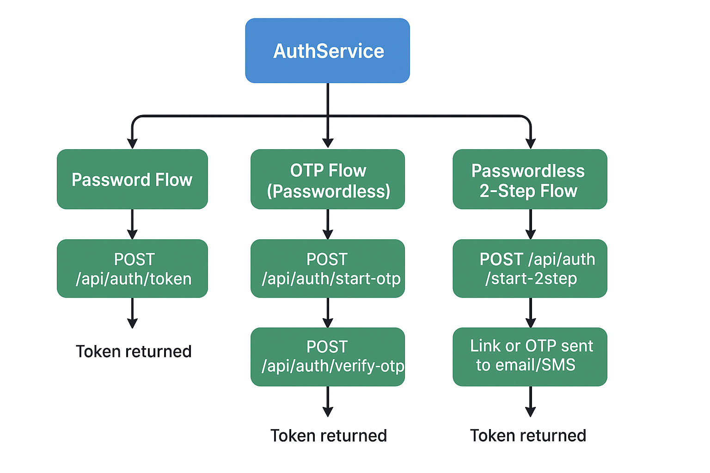

## ❓ Q1: What is the purpose of `AuthenticationEntryPoint`?
🅰️: `AuthenticationEntryPoint` is used to handle unauthorized access **when no authentication is provided**. It is triggered when a request is made to a protected resource without valid credentials (e.g., missing or expired JWT). It typically returns a `401 Unauthorized` response.

## ❓ Q2: When is `AuthenticationEntryPoint` called?
🅰️: It is called **before any authentication attempt**, when a user tries to access a secured endpoint **without being authenticated**.

## ❓ Q3: What is the purpose of `AuthenticationFailureHandler`?
🅰️: `AuthenticationFailureHandler` is triggered **when authentication fails** during a login attempt. For example, if a user provides invalid credentials (wrong username or password), this handler is called to return an error response.

## ❓ Q4: When is `AuthenticationFailureHandler` called?
🅰️: It is called `during an authentication attempt`, typically through a login form or custom login endpoint, `when the provided credentials are invalid`.

## ❓ Q5: How are they configured in Spring Security?
🅰️: `AuthenticationEntryPoint` is configured like this:
````java
http.exceptionHandling()
    .authenticationEntryPoint(unauthorizedHandler);
````

`AuthenticationFailureHandler` is set on the login filter:
````java
customLoginFilter.setAuthenticationFailureHandler(customFailureHandler);
````

##  Q6: What is a simple analogy to understand the difference?
- `AuthenticationEntryPoint`: <br/>
  You tried to enter a restricted area without showing any ID — you get stopped at the gate.
- `AuthenticationFailureHandler`: <br/>
  You showed an ID, but it was fake or invalid — you get rejected during verification.


## Summary Table?
| Feature                | `AuthenticationEntryPoint`                         | `AuthenticationFailureHandler`       |
| ---------------------- | -------------------------------------------------- |--------------------------------------|
| **When triggered**     | No authentication provided                         | Invalid authentication attempt       |
| **Typical context**    | Accessing a protected resource without login/token | Login attempt with wrong credentials |
| **Returns**            | 401 Unauthorized                                   | 401, error message, or redirect      |
| **Use case**           | Stateless APIs (e.g. JWT)                          | Login flow  (Form login / custom login filters)                       |
| **Where to configure** | `http.exceptionHandling()`                         | On login/authentication filter       |


---

# How passwordless 2-step verification works
The basic flow is:
1. User requests login (provides only username/email/phone — no password).
2. Backend generates an OTP (or magic link) and sends it (email/SMS/etc.).
3. User enters the OTP (or clicks link).
4. Backend verifies OTP.
5. Backend issues JWT token.

## 1. Why you need a new strategy
In your current code:
````java
AuthenticationStrategy s = strategies.get(flow);
````
Each strategy handles a specific `flow`. <br/>
Currently you have:
- `"password"` → username + password login.
- Maybe `"otp"` for second-factor in password flow.
For passwordless, you’d add:
- `"passwordless"` → username/email only → sends OTP.


## 2. Implementation steps
### (a) Define a `PasswordlessAuthStrategy`
````java
@Component("passwordless")
@RequiredArgsConstructor
public class PasswordlessAuthStrategy implements AuthenticationStrategy {
    private final OtpService otpService;

    @Override
    public Object start(AuthRequest req) {
        String usernameOrEmail = req.getUsername();
        // Generate OTP and sessionId
        String sessionId = otpService.createSession(usernameOrEmail);
        otpService.sendOtp(usernameOrEmail, sessionId);
        return Map.of("message", "OTP sent", "sessionId", sessionId);
    }
}
````
### (b) Add OTP verification endpoint
````java
@PostMapping("/verify-otp")
public AuthResponse verifyOtp(@RequestParam String sessionId, @RequestParam String otp) {
    return authService.verifyOtpAndIssueToken(sessionId, otp);
}
````
This will work for passwordless too — just reuse it. <br/>
The difference is: in passwordless, the session was created without a password check.

### (c) No password authentication provider needed
Since passwordless bypasses the password check, you don’t need a `DaoAuthenticationProvider` in this flow — it’s pure OTP.

---

## 3. Security considerations
- OTP lifetime should be short (e.g., 2–5 minutes).
- Session binding: OTP should only be valid for the user/session it was issued to.
- Rate limiting: prevent brute-force OTP guesses.
- Fallback: Optionally still support password login for locked-out OTP users.

## 4. Where the strategies fit
Now your flows might look like:

| Flow name        | Strategy Class             | Step 1 Action                        | Step 2 Action           |
| ---------------- | -------------------------- | ------------------------------------ | ----------------------- |
| `"password"`     | `PasswordAuthStrategy`     | Verify username + password           | Optional OTP if enabled |
| `"passwordless"` | `PasswordlessAuthStrategy` | Send OTP to email/phone              | Verify OTP → issue JWT  |
| `"otp-only"`     | `OtpAuthStrategy`          | Skip initial login (used for step 2) | Verify OTP              |


---

# Flow Diagram

## 1️⃣ Step 1 – Request Login (Start Auth)
````css
[Client] ---- username/email ----> [POST /api/auth/start]

    AuthController.startAuth(AuthRequest req)
        ↓
    AuthService.startAuth(req)
        ↓
    strategies.get("passwordless") → PasswordlessAuthStrategy.start()
            • Create sessionId in OtpService
            • Generate OTP (e.g., 6-digit)
            • Store (username, otp, expiry) in cache/DB
            • Send OTP to user via SMS/Email
        ↓
    Return JSON: { message: "OTP sent", sessionId: "abc123" }
[Client] <---- OTP sent ----
````

## 2️⃣ Step 2 – Verify OTP
````plantext
[Client] ---- sessionId + otp ----> [POST /api/auth/verify-otp]

    AuthController.verifyOtp(sessionId, otp)
        ↓
    AuthService.verifyOtpAndIssueToken(sessionId, otp)
        ↓
    otpService.verify(sessionId, otp)
            IF fail → throw OtpInvalidException
        ↓
    username = otpService.getUsernameForSession(sessionId)
    token = jwtProvider.generateToken(username)
    Return AuthResponse { token, expAt }
[Client] <---- JWT token ----
````

## 3️⃣ JWT-protected API calls
````plaintext
[Client] ---- Authorization: Bearer <token> ----> [GET /api/secure/data]

    JwtAuthenticationFilter
        • Extract token
        • Validate signature & expiry
        • Load UserDetails
        • Set SecurityContext
        ↓
    Controller executes with authenticated principal
[Client] <---- Secure data ----
````

## 📌 Exception Handling Flow
````plaintext
IF otpService.verify() fails → OtpInvalidException
    ↓
Caught by:
    - If thrown during auth filter → AuthEntryPoint (401 JSON)
    - If thrown in controller/service → GlobalExceptionHandler for security module

````

## 💡 High-Level Diagram
````pgsql
+---------+        +-------------------+        +-------------------+
|  Client | -----> | /api/auth/start    | -----> | PasswordlessAuth   |
|         |        | (flow=passwordless)|        | Strategy.start()   |
+---------+        +-------------------+        +-------------------+
                                                  |
                                                  v
                                            +-----------+
                                            | OtpService|
                                            | createOTP |
                                            +-----------+
                                                  |
                                                  v
                                             OTP sent to user
                                                  |
                                                  v
+---------+        +-------------------+        +-------------------+
|  Client | -----> | /api/auth/verify-otp| ----> | AuthService.verify|
|         |        +-------------------+        +-------------------+
                                                  |
                                                  v
                                            +-----------+
                                            | OtpService|
                                            | verifyOTP |
                                            +-----------+
                                                  |
                                                  v
                                             Generate JWT
                                                  |
                                                  v
+---------+ <--------------------------------+-----------+
|  Client |                                  | AuthResponse|
+---------+                                  +-----------+

````

## 📌 Unified High-Level Flow Diagram
````pgsql
                        +---------------------+
                        |     Client App      |
                        +----------+----------+
                                   |
                        POST /api/auth/start
                                   |
                                   v
                        +----------+----------+
                        |   AuthController    |
                        +----------+----------+
                                   |
                      AuthService.startAuth(req)
                                   |
                                   v
+-----------------------------------------------------------+
| strategies Map<String, AuthenticationStrategy>            |
|-----------------------------------------------------------|
| "password"   → PasswordAuthStrategy.start()               |
| "passwordless" → PasswordlessAuthStrategy.start()         |
| "2step"      → TwoStepAuthStrategy.start()                |
+-----------------------------------------------------------+
                                   |
                 +-----------------+-----------------+
                 |                                   |
   Password Flow (1)                      OTP Generation Flow (2 & 3)
                 |                                   |
   Validate username/password              Create OTP in OtpService
   If OK → Issue JWT (Flow 1)               Store sessionId, username, otp, expiry
                                             Send OTP via Email/SMS
                 |                                   |
                 v                                   v
           Return JWT                     Return { message, sessionId }
           (Flow 1 ends)                    (Flow 2 & 3 go to next step)
                 |
                 v
--- Secured APIs use JWTAuthenticationFilter to validate token ---


               **Step 2 for OTP-based Flows (Passwordless & 2-step)**

                        +----------------------+
                        | POST /verify-otp     |
                        +----------------------+
                                   |
                        AuthService.verifyOtpAndIssueToken
                                   |
                                   v
                        OtpService.verify(sessionId, otp)
                                   |
                        If fail → throw OtpInvalidException
                                   |
                        If pass → Get username from session
                                   |
                        Generate JWT via JwtProvider
                                   |
                        Return AuthResponse { token, expAt }
                                   |
                        Client stores token for subsequent API calls

````

## 🗂 Flow Summary Table
| Flow Name        | Step 1 Action                                      | Step 2 Action                    | Token Issued?     |
| ---------------- | -------------------------------------------------- | -------------------------------- | ----------------- |
| Password         | `/startAuth` with username/password → verify → JWT | N/A                              | Yes (immediately) |
| Passwordless OTP | `/startAuth` with username → OTP sent              | `/verify-otp` with sessionId+otp | Yes               |
| Two-Step         | `/startAuth` with username/password → OTP sent     | `/verify-otp` with sessionId+otp | Yes               |


## Architecture




---

## Points to production-hardening (next steps)
1. Record login audits, IP and device info.
2. Limit OTP attempts and rate-limit login attempts.
3. Rate limiting: prevent brute-force OTP guesses.
4. Fallback: Optionally still support password login for locked-out OTP users.
5. Add refresh-token support
6. Use TLS/HTTPS always.
7. Use secure, sufficiently random secret for JWT. Rotate keys using JWKs if needed.
8. Add multi-factor backup codes, remember-device, TOTP (Google Authenticator) support as additional strategies.
