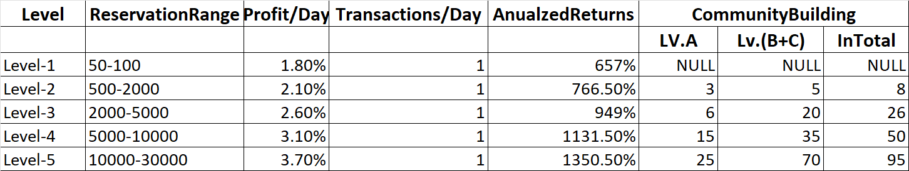
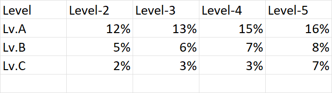

## 🧩 Daily Income Design Problem Statement
In a Multi-Level Marketing (MLM) system, when a user sells a product:
1. They earn a daily income based on their wallet balance and commission percentage (from RankConfig).
2. Their upline members earn a team/community income as a percentage of that daily income, based on their rank and depth (Lv.A, Lv.B, Lv.C).
3. This team income should propagate up the hierarchy until the root.
4. All incomes should be saved for historical reporting in a table (e.g., IncomeHistory).





### 📦 Tables Involved
- **User:** contains walletBalance and rankLevel.
- **UserHierarchy:** closure table with ancestor, descendant, and depth.
- **RankConfig:** maps Rank to daily profit %, wallet balance range, and required downline.
- **TeamIncomeConfig:** maps Rank to % commission for downline levels A (depth=1), B (2), C (3).


## ✅ Step-by-Step Solution

**1. 🧱 Entity: TeamIncomeConfig**
````java
@Entity
@Table(name = "team_income_config")
public class TeamIncomeConfig {
    @Id
    @Column(name = "rank_code")
    private String rankCode;

    @ElementCollection
    @CollectionTable(name = "team_income_percentages", joinColumns = @JoinColumn(name = "rank_type"))
    @MapKeyColumn(name = "level") // 1 = A, 2 = B, 3 = C
    @Column(name = "percentage")
    private Map<Integer, BigDecimal> incomePercentages = new HashMap<>();
}
````

**2. 🧾 Entity: IncomeHistory**
````java
@Entity
@Table(name = "income_history")
@Getter
@Setter
@NoArgsConstructor
@AllArgsConstructor
@Builder
public class IncomeHistory {
    @Id
    @GeneratedValue(strategy = GenerationType.IDENTITY)
    private Long id;
    private Long userId; // Recipient    
    private BigDecimal amount;
    
    @Enumerated(EnumType.STRING)
    private IncomeType  type; // "DAILY" or "TEAM"
    
    private String note; // e.g. "From user 42, RANK_2"
    
    private Long sourceUserId; // Who triggered this income

    @Enumerated(EnumType.STRING)
    private Rank sourceUserRank;
    
    private LocalDate date;

    public enum IncomeType {
        DAILY, TEAM
    }
}
````

**🧮 Example: Commission Matrix**

| Rank    | Lv.A | Lv.B | Lv.C |
| ------- | ---- | ---- | ---- |
| RANK\_2 | 12%  | 5%   | 2%   |
| RANK\_3 | 13%  | 6%   | 3%   |
| RANK\_4 | 15%  | 7%   | 3%   |
| RANK\_5 | 16%  | 8%   | 7%   |

**3. ⚙️ Event: ProductSoldEvent**
````java
public class ProductSoldEvent {
    private Long sellerId;
    private BigDecimal productValue;
}
````

**4. 🎧 Listener: ProductSoldListener**
````java
@Component
@RequiredArgsConstructor
public class ProductSoldListener {
    private final IncomeDistributionService incomeService;

    @EventListener
    @Transactional
    public void handleProductSold(ProductSoldEvent event) {
        incomeService.distributeIncome(event.getSellerId(), event.getAmount());
    }
}
````

****5. ⚙️ IncomeDistributionService****
````java
@Service
@RequiredArgsConstructor
public class IncomeDistributionService {

    private final UserRepository userRepository;
    private final RankConfigRepository rankConfigRepo;
    private final TeamIncomeConfigRepository teamIncomeRepo;
    private final UserHierarchyRepository hierarchyRepo;
    private final IncomeHistoryRepository incomeRepo;

    public void processProductSale(Long sellerId, BigDecimal saleAmount) {
        User seller = userRepository.findById(sellerId).orElseThrow();
        Rank sellerRank = Rank.fromLevel(seller.getRank());
        RankConfig sellerRankConfig = rankConfigRepo.findById(sellerRank).orElseThrow();

        BigDecimal wallet = seller.getWalletBalance();
        BigDecimal dailyIncome = wallet.multiply(sellerRankConfig.getCommissionRate()).divide(BigDecimal.valueOf(100));

        // 1. Save seller daily income
        //incomeRepo.save(new IncomeHistory(sellerId, dailyIncome, "DAILY", "SELF", LocalDate.now()));
        incomeRepo.save(IncomeHistory.builder()
                .userId(sellerId)
                .amount(dailyIncome)
                .type(IncomeType.DAILY)
                .sourceUserId(sellerId)
                .sourceUserRank(sellerRank)
                .note("Self income")
                .date(LocalDate.now())
                .build());
        
        
        // 2. Fetch all uplines with rank info in a single query
        /*List<Object[]> uplineData = hierarchyRepo.findUplinesWithRank(sellerId, 3); // Depth ≤ 3

        for (Object[] row : uplineData) {
            Long uplineId = (Long) row[0];
            Integer depth = (Integer) row[1];
            Integer rankLevel = (Integer) row[2];

            Rank uplineRank = Rank.fromLevel(rankLevel);
            TeamIncomeConfig teamConfig = teamIncomeRepo.findById(uplineRank).orElse(null);
            if (teamConfig == null) continue;

            BigDecimal percentage = teamConfig.getIncomePercentages().getOrDefault(depth, BigDecimal.ZERO);
            BigDecimal teamIncome = dailyIncome.multiply(percentage).divide(BigDecimal.valueOf(100));

            if (teamIncome.compareTo(BigDecimal.ZERO) > 0) {
                //incomeRepo.save(new IncomeHistory(uplineId, teamIncome, "TEAM", "from: " + sellerId, LocalDate.now()));
                incomeRepo.save(IncomeHistory.builder()
                        .userId(uplineId)
                        .amount(teamIncome)
                        .type(IncomeType.TEAM)
                        .sourceUserId(sellerId)
                        .sourceUserRank(sellerRank)
                        .note("From user " + sellerId + ", depth " + depth)
                        .date(LocalDate.now())
                        .build());            
            }
        }*/

        // Load full hierarchy in one query
        List<UserHierarchy> hierarchy = hierarchyRepository.findByDescendant(sellerId);
        Map<Long, Integer> uplinesWithDepth = hierarchy.stream()
                .filter(UserHierarchy::isActive)
                .collect(Collectors.toMap(UserHierarchy::getAncestor, UserHierarchy::getDepth));

        // Load all upline users in a single query
        List<User> uplines = userRepository.findAllById(uplinesWithDepth.keySet());

        // Distribute team income
        teamIncomeStrategy.distributeTeamIncome(sellerId, dailyIncome, uplines, uplinesWithDepth);
    }
}
````


**6. 📦 Optimized Query in UserHierarchyRepository**
````java
public interface UserHierarchyRepository extends JpaRepository<UserHierarchy, Long> {

    @Query("""
        SELECT uh.ancestor, uh.depth, u.rank 
        FROM UserHierarchy uh
        JOIN User u ON uh.ancestor = u.id
        WHERE uh.descendant = :userId AND uh.depth <= :maxDepth AND uh.active = true
    """)
    List<Object[]> findUplinesWithRank(@Param("userId") Long userId, @Param("maxDepth") int maxDepth);
}
````

**7. 📊 Reporting Examples**
````java
@Query("""
    SELECT ih.type, SUM(ih.amount)
    FROM IncomeHistory ih
    WHERE ih.userId = :userId AND ih.date BETWEEN :start AND :end
    GROUP BY ih.type
""")
List<Object[]> getIncomeSummary(@Param("userId") Long userId, @Param("start") LocalDate start, @Param("end") LocalDate end);
````

**📌 Step 100: TeamIncomeStrategy Interface**
````java
public interface TeamIncomeStrategy {
    void distributeTeamIncome(Long sourceUserId, BigDecimal baseIncome, List<User> uplines, Map<Long, Integer> uplineDepthMap);
}
````

**📌 Step 4: DefaultTeamIncomeStrategy Implementation**
````java
@Component
@RequiredArgsConstructor
public class DefaultTeamIncomeStrategy implements TeamIncomeStrategy {

    private final IncomeHistoryRepository incomeHistoryRepository;
    private final RankConfigRepository rankConfigRepository;

    @Override
    public void distributeTeamIncome(Long sourceUserId, BigDecimal baseIncome, List<User> uplines, Map<Long, Integer> uplineDepthMap) {
        for (User upline : uplines) {
            RankConfig rankConfig = rankConfigRepository.findByRank(upline.getRank());
            int depth = uplineDepthMap.get(upline.getId());

            BigDecimal percentage = getTeamCommissionPercentage(rankConfig.getRank(), depth);
            if (percentage.compareTo(BigDecimal.ZERO) > 0) {
                BigDecimal teamIncome = baseIncome.multiply(percentage);
                incomeHistoryRepository.save(new IncomeHistory(upline.getId(), teamIncome, IncomeType.TEAM));
            }
        }
    }

    private BigDecimal getTeamCommissionPercentage(Rank rank, int depth) {
        // Replace with DB or config-based logic
        if (rank == Rank.RANK_2 && depth == 1) return BigDecimal.valueOf(0.12); // 12% Lv.A
        if (rank == Rank.RANK_2 && depth == 2) return BigDecimal.valueOf(0.05); // 5% Lv.B
        if (rank == Rank.RANK_2 && depth == 3) return BigDecimal.valueOf(0.02); // 2% Lv.C
        return BigDecimal.ZERO;
    }
}
````


---

## visualize the income by level (A/B/C) for analytics
**🧱 1. Define Income Levels (A, B, C…)**
````java
public enum IncomeLevel {
    A(1), B(2), C(3), D(4), E(5); // and so on

    private final int depth;

    IncomeLevel(int depth) {
        this.depth = depth;
    }

    public static IncomeLevel fromDepth(int depth) {
        for (IncomeLevel level : values()) {
            if (level.depth == depth) return level;
        }
        return null;
    }

    public int getDepth() {
        return depth;
    }
}
````

**📊 2. Visualize Income Grouped by Level**
````java
@Query("""
    SELECT ih.sourceUserRank, ih.type, ih.date, uh.depth, SUM(ih.amount)
    FROM IncomeHistory ih
    JOIN UserHierarchy uh ON ih.sourceUserId = uh.descendant
    WHERE ih.userId = :userId
      AND uh.ancestor = :userId
      AND ih.date BETWEEN :start AND :end
    GROUP BY ih.sourceUserRank, ih.type, ih.date, uh.depth
""")
List<Object[]> getIncomeGroupedByLevel(
    @Param("userId") Long userId,
    @Param("start") LocalDate start,
    @Param("end") LocalDate end
);
````

**Process in Service:**
````java
public Map<IncomeLevel, BigDecimal> summarizeByLevel(Long userId, LocalDate start, LocalDate end) {
    List<Object[]> rows = incomeRepo.getIncomeGroupedByLevel(userId, start, end);

    Map<IncomeLevel, BigDecimal> levelIncome = new HashMap<>();

    for (Object[] row : rows) {
        Integer depth = (Integer) row[3];
        BigDecimal amount = (BigDecimal) row[4];

        IncomeLevel level = IncomeLevel.fromDepth(depth);
        if (level != null) {
            levelIncome.merge(level, amount, BigDecimal::add);
        }
    }

    return levelIncome;
}
````

**📤 3. Export Monthly Report (CSV / Excel / PDF)**

You can generate CSV or Excel easily using a utility like Apache POI or OpenCSV.


**Example: CSV Export (OpenCSV)**
````java
public void exportMonthlyIncomeReport(Long userId, OutputStream outputStream, YearMonth month) {
    LocalDate start = month.atDay(1);
    LocalDate end = month.atEndOfMonth();

    List<IncomeHistory> incomes = incomeRepo.findByUserIdAndDateBetween(userId, start, end);

    try (CSVWriter writer = new CSVWriter(new OutputStreamWriter(outputStream))) {
        writer.writeNext(new String[] {
            "Date", "Amount", "Type", "SourceUserId", "SourceRank", "Note"
        });

        for (IncomeHistory ih : incomes) {
            writer.writeNext(new String[] {
                ih.getDate().toString(),
                ih.getAmount().toPlainString(),
                ih.getType().name(),
                String.valueOf(ih.getSourceUserId()),
                ih.getSourceUserRank().name(),
                ih.getNote()
            });
        }
    } catch (IOException e) {
        throw new RuntimeException("Failed to export CSV", e);
    }
}

````

**🧮 Optional: Level-Based Charts on UI**
- Bar chart showing total income by level
- Pie chart for daily vs team income
- Monthly trend line of income

## ✅ REST Controller
````java
@RestController
@RequestMapping("/api/income")
@RequiredArgsConstructor
public class IncomeReportController {

    private final IncomeReportService incomeReportService;

    @GetMapping("/{userId}/summary")
    public ResponseEntity<Map<IncomeLevel, BigDecimal>> getIncomeSummaryByLevel(
            @PathVariable Long userId,
            @RequestParam @DateTimeFormat(iso = DateTimeFormat.ISO.DATE) LocalDate start,
            @RequestParam @DateTimeFormat(iso = DateTimeFormat.ISO.DATE) LocalDate end) {

        Map<IncomeLevel, BigDecimal> summary = incomeReportService.summarizeByLevel(userId, start, end);
        return ResponseEntity.ok(summary);
    }

    @GetMapping("/{userId}/export")
    public void exportIncomeReport(
            @PathVariable Long userId,
            @RequestParam("month") @DateTimeFormat(pattern = "yyyy-MM") YearMonth month,
            HttpServletResponse response) throws IOException {

        response.setContentType("text/csv");
        response.setHeader("Content-Disposition", "attachment; filename=income-report-" + month + ".csv");

        incomeReportService.exportMonthlyIncomeReport(userId, response.getOutputStream(), month);
    }
}
````

**🧠 Service Layer Recap**
````java
public interface IncomeReportService {
    Map<IncomeLevel, BigDecimal> summarizeByLevel(Long userId, LocalDate start, LocalDate end);
    void exportMonthlyIncomeReport(Long userId, OutputStream outputStream, YearMonth month);
}
````

## 🧪 Sample API Usage

**🟢 1. Get Summary by Level**
````pgsql
GET /api/income/101/summary?start=2025-05-01&end=2025-05-31
````
Response:
````json
{
  "A": 250.00,
  "B": 120.00,
  "C": 35.00
}
````

**🟢 2. Download Monthly CSV**
````pgsql
GET /api/income/101/export?month=2025-05
````
→ Triggers a file download: income-report-2025-05.csv


---

## Package Structure

````bash
com.example.mlm
│
├── event
│   └── ProductSoldEvent.java
│   └── listener/ProductSoldListener.java
│
├── income
│   └── service/IncomeDistributionService.java
│   └── strategy/TeamIncomeStrategy.java
│   └── strategy/impl/DefaultTeamIncomeStrategy.java
│
├── model
│   └── User.java
│   └── UserHierarchy.java
│   └── RankConfig.java
│   └── IncomeHistory.java
│
├── repository
│   └── UserRepository.java
│   └── UserHierarchyRepository.java
│   └── RankConfigRepository.java
│   └── IncomeHistoryRepository.java

````